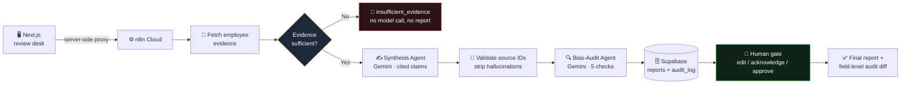

<div align="center">


### Evidence-cited performance reviews with a bias audit and an enforced human gate

[](https://bias-aware-360-review-system.vercel.app/)
[](https://nextjs.org/)
[](https://n8n.io/)
[](https://ai.google.dev/)
[](https://supabase.com/)

<br/>

**[🚀 Launch the demo](https://bias-aware-360-review-system.vercel.app/)** · **[⚡ 90-second judge path](#-90-second-judge-path)** · **[🏗 Architecture](#-architecture)**

</div>

<br/>

<p align="center">
  
</p>

> 🏆 Built for **INNOVA HACK Chapter-1 · Agentic AI · PS-2** by **Team Claude's Plan**

---

## 💡 The idea

Performance feedback lives scattered across self-assessments, manager notes, peer comments, goals, and project outcomes. Reviews built from that mess are inconsistent, bias-prone, and impossible to trace.

<div align="center">

```
  messy feedback  →  cited review  →  bias audit  →  human gate  →  audit trail
```

</div>

This system is deliberately **more than a text generator**:

|   | What it does | Why it matters |
|---|---|---|
| 🔗 | Every claim carries **source IDs** that resolve to original feedback | You can ask *"why?"* of any sentence |
| 🔍 | An **independent second agent** audits the draft for 5 bias types | The writer never grades its own homework |
| 🚫 | **High-severity flags block approval** at the API layer — HTTP 422 | Human-in-the-loop is enforced, not decorative |
| 🛑 | Thin evidence is **refused before generation** | *"Not enough data"* instead of an invented review |
| 📜 | Every action lands in an **immutable audit log** with field-level diffs | Who approved what, when, and what they changed |

---

## 🎯 Watch it catch a biased claim

The core demo, as an animation — a manager's unsupported claim meets the evidence:

<p align="center">
  
</p>

And what happens when someone tries to approve it anyway:

<p align="center">
  
</p>

---

## ⚡ 90-second judge path

> The fastest route to the money shot.

1. Open **[Arjun Mehta](https://bias-aware-360-review-system.vercel.app/review/emp_002)** → click **Generate AI Review Draft**
2. Click a **citation chip** → inspect the original source text
3. Find the **contradiction flag**: manager claims *"consistently misses deadlines"* — project outcomes show on-time launches
4. Click **Approve** → the system **blocks it with a 422** ⛔
5. Edit or acknowledge the flag → approve again → ✅ open the **audit trail**
6. Open **[Riya Kapoor](https://bias-aware-360-review-system.vercel.app/review/emp_004)** → the evidence gate refuses to draft from a single manager note

### All demo scenarios

| Scenario | Open | What to look for |
| --- | --- | --- |
| ✅ Clean review | [Priya Sharma](https://bias-aware-360-review-system.vercel.app/review/emp_001) | Grounded claims, zero flags |
| ⭐ **Main demo** | [Arjun Mehta](https://bias-aware-360-review-system.vercel.app/review/emp_002) | Contradiction caught, approval blocked |
| 🛑 Graceful refusal | [Riya Kapoor](https://bias-aware-360-review-system.vercel.app/review/emp_004) | `insufficient_evidence` — nothing fabricated |
| 📜 Governance | [Audit reports](https://bias-aware-360-review-system.vercel.app/audit-reports) | Findings, status, reviewer traceability |
| 📊 Evaluation | [Model evaluation](https://bias-aware-360-review-system.vercel.app/evaluation) | Precision, recall, F1, citation resolution |

---

## 🏗 Architecture



<details>
<summary><b>🧠 Why two agents instead of one prompt?</b></summary>
<br/>

Each agent has a single responsibility:

- **Synthesis Agent** — turns raw feedback into cited claims. It's explicitly instructed to represent claims *faithfully*, never to soften them: a diplomatic rewrite of *"consistently misses deadlines"* would hide the bias from the auditor.
- **Bias-Audit Agent** — judges the draft against the sources with fresh eyes and a different temperature. It checks: `unsupported_claim` · `recency_bias` · `single_source_bias` · `vague_language` · `contradiction`.
- **Validator (deterministic)** — between them, plain code strips any hallucinated source ID and drops uncited claims. No model gets to invent its own evidence.

Splitting responsibilities makes each stage independently testable — and means the system can *explain* its verdicts instead of just asserting them.

</details>

<details>
<summary><b>⚙️ Why n8n?</b></summary>
<br/>

The problem is orchestration-heavy: webhooks, database operations, two model calls, validation between them, and an approval state machine. n8n made each stage an inspectable node — the workflow canvas *is* the architecture diagram — and let us spend the hackathon on agent quality instead of writing orchestration plumbing from scratch.

</details>

### Stack

| Layer | Technology | Responsibility |
| --- | --- | --- |
| 🖥 Frontend | Next.js App Router · React · Tailwind | Review desk, citations, flags, approval UX |
| ⚙️ Orchestration | n8n Cloud | Webhooks, DB operations, multi-agent flow |
| 🤖 Models | Gemini ×2 | Synthesis and independent bias-audit passes |
| 🗄 Database | Supabase Postgres | Employees, reports, decisions, audit log |
| ☁️ Hosting | Vercel + n8n Cloud | Public app and server-side workflow endpoints |

---

## 📸 Screenshots

<table>
  <tr>
    <td align="center" width="50%">
      <a href="shots/pg-home.png"></a><br />
      <sub><b>01 · Editorial overview</b><br />Cycle-wide evidence and bias metrics</sub>
    </td>
    <td align="center" width="50%">
      <a href="shots/4-report.png"></a><br />
      <sub><b>02 · Evidence-cited review</b><br />Claims, sections, and source coverage</sub>
    </td>
  </tr>
  <tr>
    <td align="center" width="50%">
      <a href="shots/6-drawer.png"></a><br />
      <sub><b>03 · Citation drawer</b><br />Trace a claim back to the original feedback</sub>
    </td>
    <td align="center" width="50%">
      <a href="shots/10-blocked.png"></a><br />
      <sub><b>04 · Human approval gate</b><br />High-severity flags block finalization</sub>
    </td>
  </tr>
</table>

---

## 🛡 How the workflow protects fairness

### 1️⃣ Evidence grounding
The synthesis prompt receives a flattened source list with a **valid-ID whitelist**. A validator strips hallucinated source IDs and drops uncited claims. The UI reports citation coverage rather than hiding failures.

### 2️⃣ Two independent bias signals
The Gemini audit judges the *wording* of the draft. A deterministic pre-check independently measures source concentration, observation window, and voice balance from the raw file — explicitly a heuristic, not a fairness verdict.

### 3️⃣ Evidence gate
Before either model call, Workflow A requires **at least two reviewer voices and one objective record** (goal or project outcome). Otherwise it returns `insufficient_evidence`, performs no generation, and creates no report.

### 4️⃣ Human approval is enforced
Workflow B **rejects approval** while high-severity flags remain unedited and unacknowledged. Edits are diffed field-by-field and stored with actor, action, timestamp, and acknowledged references.

---

## 🗂 Repository map

```text
app/                         Next.js pages and server-side API proxies
components/                  Reusable review UI
data/mock_employees/         Seed fixtures, including the thin-evidence case
data/mock_reports/           Captured offline reports
db/                          Supabase schema and seed data
lib/                         Source mapping, evidence stats, schemas, evaluation
n8n-workflows/               Importable generate and approval workflows
prompts/                     Synthesis and bias-audit prompts
scripts/                     Workflow migration and pipeline helpers
docs/                        Animated README visuals + schema docs
```

---

## 🚀 Run locally

```bash
npm install
cp .env.example .env.local
npm run dev
```

Leave `N8N_WEBHOOK_URL` empty to use captured reports offline. Set it to the n8n webhook base URL to exercise the live backend through the Next.js proxy. The webhook URL is intentionally **server-only** — never exposed as `NEXT_PUBLIC_`.

### Verify the project

```bash
npm run typecheck && npm test && npm run build && npm run verify
```

The test suite covers source resolution, evidence statistics, n8n response shapes, runtime schemas, cross-artifact contracts, the insufficient-evidence case, and the captured-report evaluation benchmark (`npm run evaluation:report`).

---

## ⚖️ Honest limitations

- No authentication; the reviewer identity is a fixed demo value.
- Feedback is synthetic demo data, not production employee data.
- The bias audit is advisory; a reviewer can acknowledge a flag and proceed — but that acknowledgment is permanently recorded.
- An amended claim is marked as edited after the original audit; it is not silently re-audited.
- Retention, deletion, consent, and production access controls are outside hackathon scope.

---

<div align="center">

### Built by **Team Claude's Plan** for INNOVA HACK Chapter-1

**[🚀 Open the live demo](https://bias-aware-360-review-system.vercel.app/)** · **[📖 Read the source](https://github.com/satyamshrivastav955-dotcom/bias-aware-360-review-system)**

<sub>Every claim cited · every bias caught · nothing final without a human</sub>

</div>
