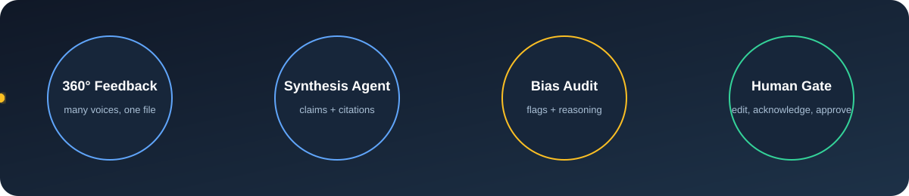
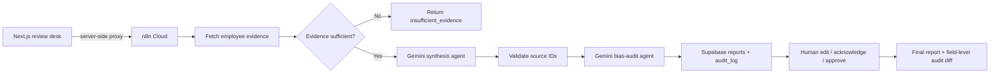
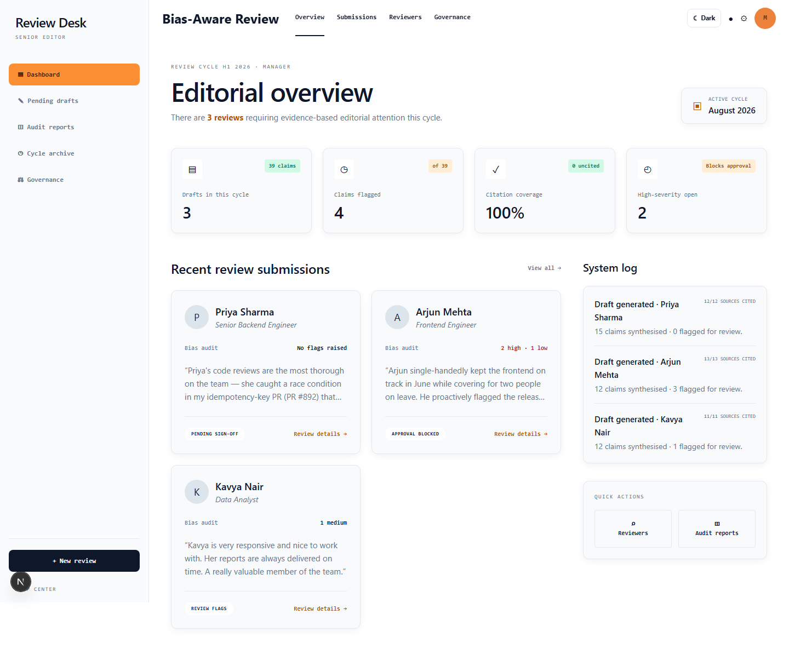
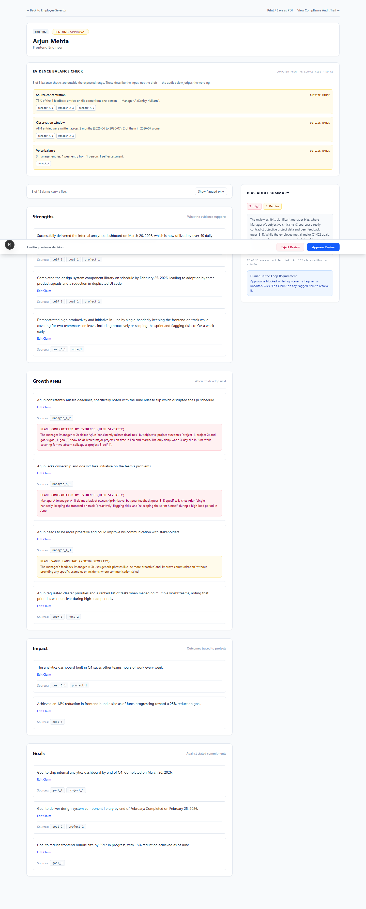
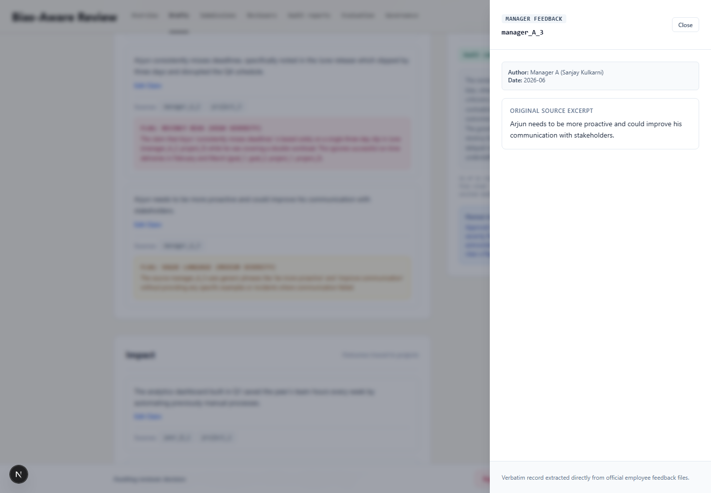
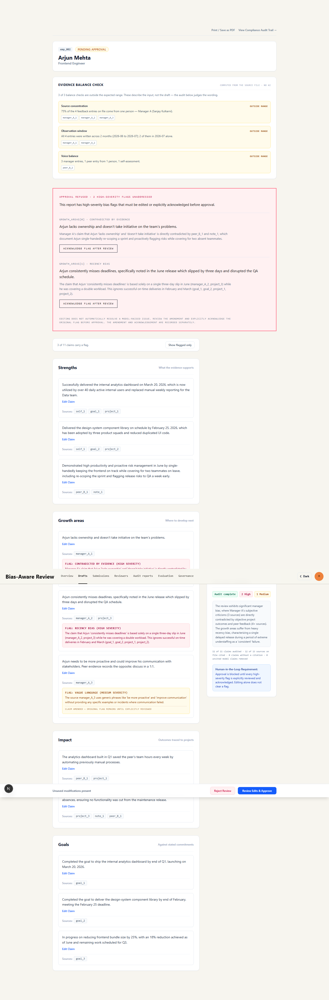

<div align="center">

# Bias-Aware 360° Review Desk

### Evidence-cited performance reviews with a bias audit and an enforced human gate.

[](https://bias-aware-360-review-system.vercel.app/)
[](https://nextjs.org/)
[](https://n8n.io/)
[](https://supabase.com/)

**[Launch the demo →](https://bias-aware-360-review-system.vercel.app/)** · **[Explore the code →](https://github.com/satyamshrivastav955-dotcom/bias-aware-360-review-system)**

</div>

<p align="center">
  
</p>

> Built for **INNOVA HACK Chapter-1 · Agentic AI · PS-2**.

## The idea

Performance feedback is usually scattered across self-assessments, manager notes, peer comments, goals, and project outcomes. This system turns that mess into a review a manager can inspect before it reaches an employee.

**Feedback in → cited review → independent bias audit → human decision → accountable audit trail.**

The system is deliberately more than a text generator:

- Every generated claim carries source IDs that resolve to the original feedback.
- A second agent audits the draft for unsupported claims, recency bias, single-source bias, vague language, and contradictions.
- High-severity flags block approval until a reviewer edits or explicitly acknowledges them.
- Thin evidence is refused before model generation; the system says “not enough data” instead of inventing a review.

## Try the demo

| Scenario | What to open | What to look for |
| --- | --- | --- |
| Clean review | [Priya Sharma](https://bias-aware-360-review-system.vercel.app/review/emp_001) | Grounded claims with no bias flags |
| Main demo | [Arjun Mehta](https://bias-aware-360-review-system.vercel.app/review/emp_002) | “Misses deadlines” contradicted by objective delivery evidence |
| Graceful failure | [Riya Kapoor](https://bias-aware-360-review-system.vercel.app/review/emp_004) | Insufficient evidence response; no report is fabricated |
| Governance | [Audit reports](https://bias-aware-360-review-system.vercel.app/audit-reports) | Findings, status, and reviewer traceability |
| Evaluation | [Model evaluation](https://bias-aware-360-review-system.vercel.app/evaluation) | Precision, recall, F1, citation resolution, and disagreements |

### 90-second judge path

1. Open Arjun’s review and click **Generate AI Review Draft**.
2. Open a citation chip and inspect the original source text.
3. Find the contradiction flag: the manager claims missed deadlines while project outcomes show on-time launches.
4. Click **Approve**. The system blocks approval with a 422 response.
5. Edit or acknowledge the flagged claim, approve again, and open the audit trail.
6. Open Riya’s page to show the evidence gate refusing to draft from one manager note.

## Architecture



### Stack

| Layer | Technology | Responsibility |
| --- | --- | --- |
| Frontend | Next.js App Router, React, Tailwind | Review desk, citations, flags, approval UX |
| Orchestration | n8n Cloud | Webhooks, database operations, multi-agent flow |
| Models | Gemini | Synthesis and independent bias-audit passes |
| Database | Supabase Postgres | Employees, reports, final decisions, audit log |
| Hosting | Vercel + n8n Cloud | Public app and server-side workflow endpoints |

## Screenshots

<p align="center">
  
  
  
  
</p>

## How the workflow protects fairness

### 1. Evidence grounding

The synthesis prompt receives a flattened source list with a valid-ID whitelist. A validator strips hallucinated source IDs and drops uncited claims. The UI reports citation coverage rather than hiding failures.

### 2. Two independent bias signals

The Gemini audit judges the wording of the draft. A deterministic pre-check independently measures source concentration, observation window, and voice balance from the raw file. The pre-check is explicitly a heuristic—not a fairness verdict.

### 3. Evidence gate

Before either model call, Workflow A requires at least two reviewer voices and at least one objective record: a goal or project outcome. Otherwise it returns `insufficient_evidence`, performs no model generation, and creates no report.

### 4. Human approval is enforced

Workflow B rejects approval while high-severity flags remain unedited and unacknowledged. Edits are compared field-by-field and stored with actor, action, timestamp, and acknowledged references.

## Repository map

```text
app/                         Next.js pages and server-side API proxies
components/                  Reusable review UI
data/mock_employees/         Seed fixtures, including the thin-evidence case
data/mock_reports/           Captured offline reports
db/                          Supabase schema and seed data
lib/                         Source mapping, evidence stats, schemas, evaluation
n8n-workflows/               Importable generate and approval workflows
prompts/                     Synthesis and bias-audit prompts
scripts/                     Workflow migration and pipeline helpers
docs/review-pipeline.svg     Animated README architecture visual
```

## Run locally

```bash
npm install
cp .env.example .env.local
npm run dev
```

Leave `N8N_WEBHOOK_URL` empty to use captured reports offline. Set it to the n8n webhook base URL to exercise the live backend through the Next.js proxy. The webhook URL is intentionally server-only and is never exposed as a `NEXT_PUBLIC_` variable.

## Verify the project

```bash
npm run typecheck
npm test
npm run build
npm run verify
```

The test suite covers source resolution, evidence statistics, n8n response shapes, runtime schemas, cross-artifact contracts, the insufficient-evidence case, and the captured-report evaluation benchmark.

To inspect the benchmark:

```bash
npm run evaluation:report
```

## Honest limitations

- There is no authentication; the reviewer identity is a fixed demo value.
- Feedback is synthetic demo data, not production employee data.
- The bias audit is advisory; a reviewer can acknowledge a flag and proceed.
- An amended claim is marked as edited after the original audit; it is not silently re-audited.
- Retention, deletion, consent, and production access controls are outside this hackathon scope.

## Credits

Built by **Team Claude’s Plan** for INNOVA HACK Chapter-1.

<div align="center">

**[Open the live demo](https://bias-aware-360-review-system.vercel.app/) · [Read the source](https://github.com/satyamshrivastav955-dotcom/bias-aware-360-review-system)**

</div>
